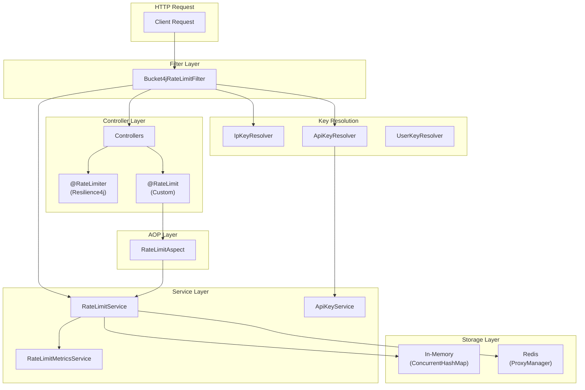
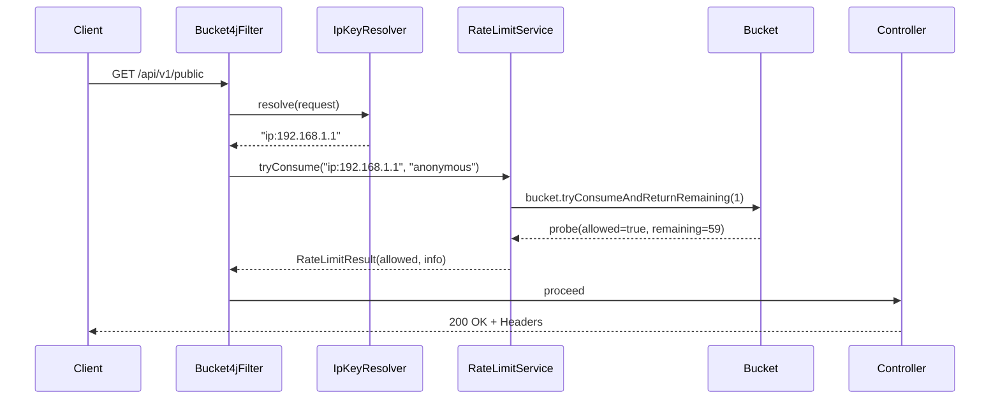
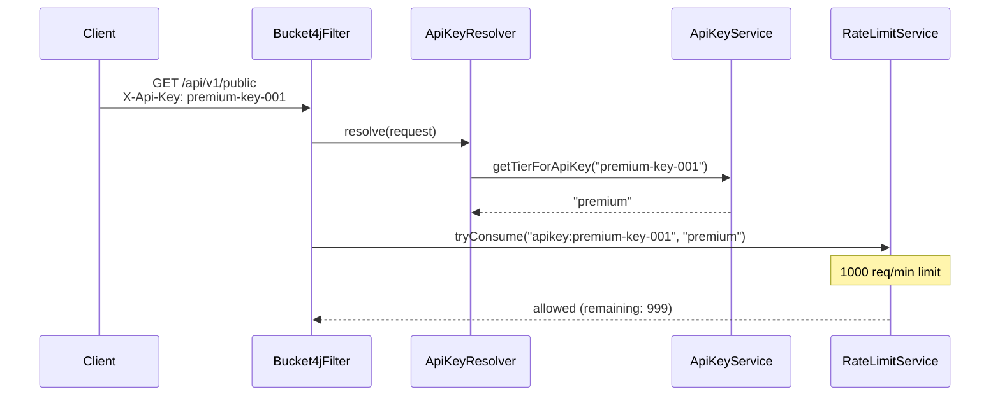
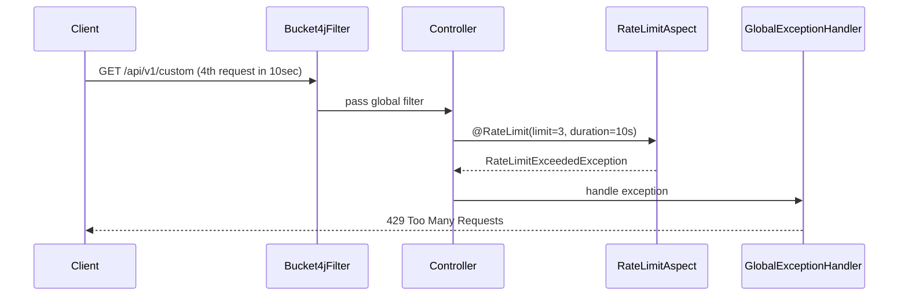

# Rate Limiting Flow & Component Guide

A comprehensive guide explaining each component's purpose, when to use it, and how they work together.

---

## Architecture Overview



---

## Component Details

### 1. Configuration Layer

---

#### RateLimitProperties

**Path:** [RateLimitProperties.java](file:///d:/anitgravity/spring-boot-projects/rate-limiting-demo/src/main/java/org/codeart/ratelimit/config/RateLimitProperties.java)

**Purpose:** Externalize all rate limit configuration to `application.yml`

**When to Use:**
- When you need configurable rate limits without code changes
- When different environments need different limits (dev/staging/prod)
- When supporting multiple API key tiers

**Key Features:**
```yaml
rate-limit:
  enabled: true
  tiers:
    free:
      requests-per-minute: 10
      burst-capacity: 15
```

---

#### RateLimitConfig

**Path:** [RateLimitConfig.java](file:///d:/anitgravity/spring-boot-projects/rate-limiting-demo/src/main/java/org/codeart/ratelimit/config/RateLimitConfig.java)

**Purpose:** Configure Redis-backed distributed buckets

**When to Use:**
- Multi-instance deployments (Kubernetes, AWS ECS)
- When rate limits must be shared across servers
- High availability requirements

**Scenario:**
> *User A hits Server 1, then Server 2. Without Redis, each server would allow separate limits. With Redis, the limit is shared.*

---

### 2. Key Resolver Layer

---

#### IpKeyResolver

**Path:** [IpKeyResolver.java](file:///d:/anitgravity/spring-boot-projects/rate-limiting-demo/src/main/java/org/codeart/ratelimit/resolver/IpKeyResolver.java)

**Purpose:** Identify clients by IP address

**When to Use:**
- Anonymous/public endpoints
- DDoS protection
- Preventing abuse from specific IPs

**Handles:**
- `X-Forwarded-For` (Load balancers)
- `CF-Connecting-IP` (Cloudflare)
- `X-Real-IP` (Nginx)
- IPv6 localhost normalization

---

#### ApiKeyResolver

**Path:** [ApiKeyResolver.java](file:///d:/anitgravity/spring-boot-projects/rate-limiting-demo/src/main/java/org/codeart/ratelimit/resolver/ApiKeyResolver.java)

**Purpose:** Identify clients by API key header

**When to Use:**
- SaaS API products with paid tiers
- Developer APIs with rate limit quotas
- B2B integrations

**Scenario:**
> *Free tier users get 10 req/min, Premium users get 1000 req/min using the same endpoint.*

---

#### UserKeyResolver

**Path:** [UserKeyResolver.java](file:///d:/anitgravity/spring-boot-projects/rate-limiting-demo/src/main/java/org/codeart/ratelimit/resolver/UserKeyResolver.java)

**Purpose:** Identify clients by authenticated user

**When to Use:**
- Logged-in user rate limiting
- Per-user quotas in applications
- When users may use multiple IPs

---

### 3. Service Layer

---

#### RateLimitService

**Path:** [RateLimitService.java](file:///d:/anitgravity/spring-boot-projects/rate-limiting-demo/src/main/java/org/codeart/ratelimit/service/RateLimitService.java)

**Purpose:** Core rate limiting logic using token bucket algorithm

**Key Methods:**
| Method | Purpose |
|--------|---------|
| `tryConsume()` | Check if request is allowed |
| `getStatus()` | Get current bucket state |
| `resetLimit()` | Admin: reset a specific key |

**When to Use:**
- Any component needing rate limit checks
- Custom rate limiting logic

---

#### ApiKeyService

**Path:** [ApiKeyService.java](file:///d:/anitgravity/spring-boot-projects/rate-limiting-demo/src/main/java/org/codeart/ratelimit/service/ApiKeyService.java)

**Purpose:** Map API keys to rate limit tiers

**When to Use:**
- Validating API keys
- Looking up user subscription tier
- Admin: viewing API key info

**Production Note:** Replace with database/cache lookup for real applications.

---

#### RateLimitMetricsService

**Path:** [RateLimitMetricsService.java](file:///d:/anitgravity/spring-boot-projects/rate-limiting-demo/src/main/java/org/codeart/ratelimit/service/RateLimitMetricsService.java)

**Purpose:** Track rate limiting metrics for monitoring

**Metrics Exported:**
```
rate_limit_requests_total{tier="basic"}
rate_limit_rejected_total{tier="basic"}
rate_limit_check_latency
```

**When to Use:**
- Prometheus/Grafana dashboards
- Alerting on high rejection rates
- Capacity planning

---

### 4. Filter & Interceptor Layer

---

#### Bucket4jRateLimitFilter

**Path:** [Bucket4jRateLimitFilter.java](file:///d:/anitgravity/spring-boot-projects/rate-limiting-demo/src/main/java/org/codeart/ratelimit/filter/Bucket4jRateLimitFilter.java)

**Purpose:** Global rate limiting at the servlet filter level

**When to Use:**
- Protect ALL endpoints uniformly
- First line of defense against abuse
- IP-based or API-key-based global limits

**Response Headers Added:**
```
X-RateLimit-Limit: 100
X-RateLimit-Remaining: 95
X-RateLimit-Reset: 1705350060
X-RateLimit-Tier: basic
```

---

#### RateLimitInterceptor

**Path:** [RateLimitInterceptor.java](file:///d:/anitgravity/spring-boot-projects/rate-limiting-demo/src/main/java/org/codeart/ratelimit/interceptor/RateLimitInterceptor.java)

**Purpose:** Add request timing and logging at MVC level

**When to Use:**
- Request timing metrics
- Debug logging for rate limit processing
- Additional MVC-level processing

---

### 5. Annotation & AOP Layer

---

#### @RateLimit Annotation

**Path:** [RateLimit.java](file:///d:/anitgravity/spring-boot-projects/rate-limiting-demo/src/main/java/org/codeart/ratelimit/annotation/RateLimit.java)

**Purpose:** Declarative method-level rate limiting

**When to Use:**
- Endpoint-specific limits different from global
- Resource-intensive endpoints (reports, exports)
- Fine-grained control per method

**Example:**
```java
@RateLimit(limit = 3, duration = 10, timeUnit = TimeUnit.SECONDS)
public void expensiveOperation() { ... }
```

---

#### RateLimitAspect

**Path:** [RateLimitAspect.java](file:///d:/anitgravity/spring-boot-projects/rate-limiting-demo/src/main/java/org/codeart/ratelimit/aspect/RateLimitAspect.java)

**Purpose:** Process `@RateLimit` annotations via AOP

**When to Use:**
- Automatically - triggered by `@RateLimit` annotation

---

### 6. Controller Layer

---

#### RateLimitDemoController

**Path:** [RateLimitDemoController.java](file:///d:/anitgravity/spring-boot-projects/rate-limiting-demo/src/main/java/org/codeart/ratelimit/controller/RateLimitDemoController.java)

**Endpoints:**
| Path | Strategy | Scenario |
|------|----------|----------|
| `/api/v1/public` | Global Filter | Public API with tier-based limits |
| `/api/v1/protected` | @RateLimiter | Strict limit (5/min) |
| `/api/v1/custom` | @RateLimit | Custom per-endpoint limit |

---

#### RateLimitAdminController

**Path:** [RateLimitAdminController.java](file:///d:/anitgravity/spring-boot-projects/rate-limiting-demo/src/main/java/org/codeart/ratelimit/controller/RateLimitAdminController.java)

**Purpose:** Admin operations for rate limit management

**Endpoints:**
| Path | Purpose |
|------|---------|
| `/api/v1/admin/config` | View configuration |
| `/api/v1/admin/metrics` | View metrics |
| `/api/v1/admin/limits/{key}` | Reset a limit |

---

## Request Flow Examples

### Scenario 1: Public API Request



### Scenario 2: API Key Premium Request



### Scenario 3: Custom @RateLimit Exceeded



---

## Decision Guide: Which Strategy to Use?

| Requirement | Use This | Profile |
|-------------|----------|---------|
| Protect all endpoints uniformly | `Bucket4jRateLimitFilter` | any |
| Different limits per endpoint | `@RateLimit` annotation | any |
| Simple method-level limits | `@RateLimiter` (Resilience4j) | any |
| Multi-instance (Token Bucket) | Bucket4j + Redis | `redis` |
| Multi-instance (Fixed Window) | Redis INCR | `redis-incr` |
| Multi-instance (Sliding Window) | Redis Lua | `redis-lua` |
| Per-user limits | `UserKeyResolver` | any |
| Tiered API pricing | `ApiKeyResolver` + tiers | any |

---

## Redis-Only Rate Limiters (NEW)

### RedisIncrRateLimiter (Fixed Window)

**Path:** [RedisIncrRateLimiter.java](file:///d:/anitgravity/spring-boot-projects/rate-limiting-demo/src/main/java/org/codeart/ratelimit/service/RedisIncrRateLimiter.java)

**Algorithm:** Fixed Window Counter using `INCR` + `EXPIRE`

**How it Works:**
```
INCR key           → count = 1, 2, 3...
IF count == 1 THEN
  EXPIRE key 60    → window starts
IF count > limit THEN
  REJECT
```

**Pros:**
- ✅ Simple, only 2 Redis commands
- ✅ Low memory usage
- ✅ No external library

**Cons:**
- ⚠️ Window boundary burst (2x limit at 0:59 + 1:00)

**Run:**
```bash
mvn spring-boot:run -Dspring-boot.run.profiles=redis-incr
```

---

### RedisLuaRateLimiter (Sliding Window)

**Path:** [RedisLuaRateLimiter.java](file:///d:/anitgravity/spring-boot-projects/rate-limiting-demo/src/main/java/org/codeart/ratelimit/service/RedisLuaRateLimiter.java)

**Algorithm:** Sliding Window Log using Lua script

**How it Works:**
```lua
ZREMRANGEBYSCORE key -inf (now - window)  -- Remove expired
ZCARD key                                  -- Count current
IF count < limit THEN
  ZADD key now request_id                  -- Add entry
  RETURN allowed
ELSE
  RETURN rejected
```

**Pros:**
- ✅ Accurate sliding window
- ✅ No boundary burst issues
- ✅ Atomic via Lua script

**Cons:**
- ⚠️ Higher memory (stores each timestamp)
- ⚠️ More complex script

**Run:**
```bash
mvn spring-boot:run -Dspring-boot.run.profiles=redis-lua
```

---

## Algorithm Comparison

| Algorithm | Profile | Library | Window Type | Burst Issue |
|-----------|---------|---------|-------------|-------------|
| Token Bucket | `local` | Bucket4j | Continuous | ❌ None |
| Token Bucket | `redis` | Bucket4j | Continuous | ❌ None |
| Fixed Window | `redis-incr` | Redis only | Fixed 1min | ⚠️ Possible |
| Sliding Window | `redis-lua` | Redis only | Sliding | ❌ None |

---

## Quick Reference: Start Commands

```bash
# In-memory (default)
mvn spring-boot:run

# Bucket4j + Redis
docker-compose up -d
mvn spring-boot:run -Dspring-boot.run.profiles=redis

# Redis INCR (Fixed Window)
mvn spring-boot:run -Dspring-boot.run.profiles=redis-incr

# Redis Lua (Sliding Window)
mvn spring-boot:run -Dspring-boot.run.profiles=redis-lua
```
